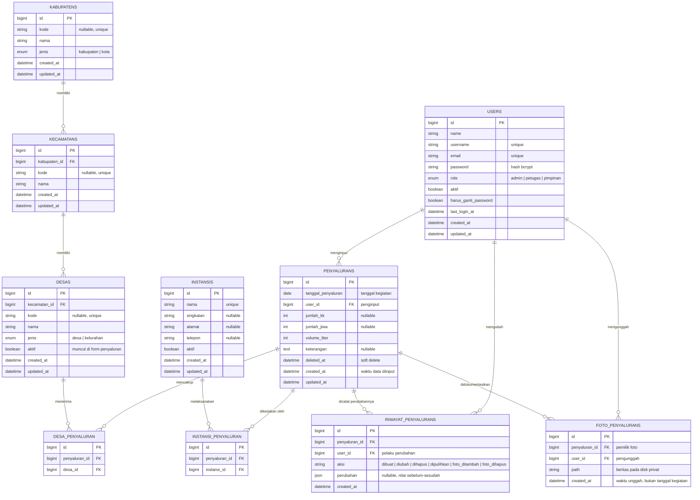

# DATABASE SCHEMA / ERD
## Sicatat — Sistem Informasi Pencatatan Penyaluran Bantuan Air Bersih

| | |
|---|---|
| **Instansi** | BPBD Provinsi Gorontalo |
| **Versi dokumen** | 2.1 |
| **Acuan** | [`PRD.md`](PRD.md), [`technical-architecture.md`](technical-architecture.md), dokumen operasional di [`sumber/`](sumber/) |
| **DBMS** | MySQL 8.4 — `utf8mb4` / `utf8mb4_unicode_ci` |
| **Nama database** | `sicatat` |
| **Tahap** | Tahap 3 dari PRD bagian 14 |

> **Perubahan dari versi 1.0.** Setelah menelaah dokumen operasional asli
> (*Update Kegiatan Penyaluran Bantuan Air Bersih 1–24 Agustus 2026* dan
> *Laporan Sementara Distribusi Air Bersih 25 Agustus 2026*), model "satu data =
> satu desa" pada PRD 8.5 ternyata tidak mampu menampung cara pencatatan yang
> sebenarnya. Skema disesuaikan pada tiga titik — dijelaskan di [§10](#10-penyesuaian-terhadap-prd).
>
> **Perubahan pada versi 2.1.** Dua tabel pendamping menyusul setelah versi 2.0:
> `riwayat_penyalurans` ([§3.9](#39-riwayat_penyalurans--riwayat-perubahan-data-penyaluran))
> untuk jejak koreksi data historis, dan `foto_penyalurans`
> ([§3.10](#310-foto_penyalurans--dokumentasi-foto-kegiatan)) untuk dokumentasi foto kegiatan.

---

## 1. Gambaran Umum

Skema terdiri dari **10 tabel**: satu tabel transaksi (`penyalurans`), lima tabel master, dua tabel penghubung, dan dua tabel pendamping yang menggantung pada tabel transaksi (`riwayat_penyalurans` dan `foto_penyalurans`).

```
                       ┌──────────────┐
                       │  kabupatens  │  6 kab/kota di Provinsi Gorontalo
                       └──────┬───────┘
                              │ 1 : N
                       ┌──────▼───────┐
                       │  kecamatans  │  77 kecamatan
                       └──────┬───────┘
                              │ 1 : N
                       ┌──────▼───────┐
                       │     desas    │  729 desa / kelurahan
                       └──────┬───────┘
                              │ N : M
                     ┌────────▼─────────┐
                     │  desa_penyaluran │
                     └────────┬─────────┘
                              │
   ┌──────────────┐    ┌──────▼───────┐    ┌──────────────┐
   │  instansis   │    │  penyalurans │───►│    users     │
   └──────┬───────┘    └──┬────────┬──┘ N:1└──────────────┘
          │ N : M         │        │  TABEL TRANSAKSI  penginput
   ┌──────▼────────────┐  │ 1:N    │ 1:N
   │ instansi_penyalu- │  │        │
   │ ran               │  │        │
   └───────────────────┘  │        │
              ┌───────────▼──┐  ┌──▼───────────────┐
              │ riwayat_pe-  │  │ foto_penyalurans │  dokumentasi kegiatan
              │ nyalurans    │  └──────────────────┘
              └──────────────┘
               jejak koreksi
```

Prinsip yang dipegang:

- **Satu baris `penyalurans` = satu kegiatan penyaluran pada satu tanggal**, yang dapat mencakup **beberapa desa** dan dikerjakan **beberapa instansi** sekaligus. Ini mengikuti bentuk laporan yang sebenarnya, bukan bentuk ideal.
- **Lokasi disimpan hanya sampai tingkat desa.** Kecamatan dan kabupaten diturunkan lewat relasi, sehingga mustahil ada data dengan kecamatan yang tidak cocok dengan kabupatennya. Ini penting karena **61 nama desa di Provinsi Gorontalo tidak unik** — ada dua "Talumopatu", dua "Modelomo", dua "Tamboo", dua "Iloheluma", dan seterusnya.
- **Volume air selalu dalam liter** (PRD 8.5: "Satuan: Liter"). Tidak ada kolom satuan, agar penjumlahan `SUM()` selalu valid.
- **Angka boleh tidak lengkap.** Volume air wajib, tetapi jumlah KK dan jiwa boleh kosong karena laporan lapangan kerap tidak mencantumkannya.
- **Tanggal kegiatan terpisah dari waktu input.** `tanggal_penyaluran` adalah tanggal kegiatan benar-benar terjadi, `created_at` adalah waktu data dimasukkan ke sistem. Keduanya tidak boleh disamakan — lihat §3.6.
- **Foto dokumentasi menempel pada kegiatan, bukan pada tanggal.** `foto_penyalurans` sengaja tidak punya kolom tanggal; tanggal dokumentasi dibaca dari kegiatan induknya, sehingga foto tidak mungkin tercatat pada tanggal yang berbeda dari kegiatannya — lihat §3.10.

---

## 2. Entity Relationship Diagram



---

## 3. Rincian Tabel

### 3.1 `users` — Pengguna Sistem

Memenuhi FR-01, FR-02, FR-03. Tabel bawaan Laravel yang ditambah kolom `username`, `role`, dan `aktif`.

| Kolom | Tipe | Null | Default | Keterangan |
|---|---|:---:|---|---|
| `id` | `bigint unsigned` PK | ✗ | auto | |
| `name` | `varchar(255)` | ✗ | — | Nama lengkap pengguna |
| `username` | `varchar(50)` UNIQUE | ✗ | — | Dipakai untuk login (PRD 8.1) |
| `email` | `varchar(255)` UNIQUE | ✗ | — | Alternatif login (PRD 8.1) |
| `email_verified_at` | `timestamp` | ✓ | `NULL` | Bawaan Laravel, tidak dipakai di MVP |
| `password` | `varchar(255)` | ✗ | — | Hash bcrypt, tidak pernah disimpan polos |
| `role` | `enum('admin','petugas','pimpinan')` | ✗ | `'petugas'` | Menentukan hak akses (FR-02) |
| `aktif` | `boolean` | ✗ | `true` | Menonaktifkan akun tanpa menghapusnya |
| `harus_ganti_password` | `boolean` | ✗ | `false` | Penanda password sementara dari admin; pengguna dipaksa menggantinya saat login |
| `last_login_at` | `timestamp` | ✓ | `NULL` | Waktu login terakhir, ditampilkan pada Manajemen Pengguna |
| `remember_token` | `varchar(100)` | ✓ | `NULL` | Bawaan Laravel |
| `created_at` / `updated_at` | `timestamp` | ✓ | `NULL` | |

**Index:** `username` (unique), `email` (unique), `role`.

Akun yang sudah pernah menginput data tidak dihapus permanen — cukup diset `aktif = false`, agar jejak penginput setiap data tetap utuh. Akun nonaktif ditolak saat login, dan bila akun dinonaktifkan ketika sesinya masih berjalan, permintaan berikutnya langsung memutus sesi tersebut.

Admin tidak pernah mengetahui password akhir milik pengguna: akun baru dan akun yang direset dibuat dengan password sementara (`harus_ganti_password = true`), lalu pengguna wajib menggantinya sendiri pada login berikutnya.

---

### 3.2 `kabupatens` — Kabupaten / Kota

Memenuhi FR-04. Berisi 6 kabupaten/kota di Provinsi Gorontalo.

| Kolom | Tipe | Null | Default | Keterangan |
|---|---|:---:|---|---|
| `id` | `bigint unsigned` PK | ✗ | auto | |
| `kode` | `varchar(10)` UNIQUE | ✓ | `NULL` | Kode wilayah, mis. `75.01` |
| `nama` | `varchar(100)` | ✗ | — | Tanpa sebutan, mis. `Bone Bolango` |
| `jenis` | `enum('kabupaten','kota')` | ✗ | `'kabupaten'` | Dipakai menampilkan "Kabupaten X" / "Kota X" |
| `created_at` / `updated_at` | `timestamp` | ✓ | `NULL` | |

**Index:** `kode` (unique), unique gabungan (`nama`, `jenis`).

**Catatan penting:** `nama` **tidak** boleh unik sendirian — di Provinsi Gorontalo ada dua wilayah bernama sama, **Kabupaten Gorontalo** dan **Kota Gorontalo**. Yang dijaga adalah keunikan gabungan nama dan jenis.

Isi tabel setelah seeding:

| Kode | Nama | Jenis | Kecamatan | Desa/Kelurahan |
|---|---|---|---:|---:|
| 75.01 | Gorontalo | kabupaten | 19 | 205 |
| 75.02 | Boalemo | kabupaten | 7 | 82 |
| 75.03 | Bone Bolango | kabupaten | 18 | 165 |
| 75.04 | Pohuwato | kabupaten | 13 | 104 |
| 75.05 | Gorontalo Utara | kabupaten | 11 | 123 |
| 75.71 | Gorontalo | kota | 9 | 50 |
| | | **Total** | **77** | **729** |

---

### 3.3 `kecamatans` — Kecamatan

Memenuhi FR-05.

| Kolom | Tipe | Null | Default | Keterangan |
|---|---|:---:|---|---|
| `id` | `bigint unsigned` PK | ✗ | auto | |
| `kabupaten_id` | `bigint unsigned` FK | ✗ | — | → `kabupatens.id`, `ON DELETE RESTRICT` |
| `kode` | `varchar(10)` UNIQUE | ✓ | `NULL` | mis. `75.03.02` |
| `nama` | `varchar(100)` | ✗ | — | mis. `Bonepantai` |
| `created_at` / `updated_at` | `timestamp` | ✓ | `NULL` | |

**Index:** `kabupaten_id`, `kode` (unique), unique gabungan (`kabupaten_id`, `nama`).

Nama kecamatan tidak unik secara nasional maupun provinsi, jadi keunikan hanya dijaga dalam satu kabupaten.

---

### 3.4 `desas` — Desa / Kelurahan

Memenuhi FR-06. Berisi 657 desa dan 72 kelurahan.

| Kolom | Tipe | Null | Default | Keterangan |
|---|---|:---:|---|---|
| `id` | `bigint unsigned` PK | ✗ | auto | |
| `kecamatan_id` | `bigint unsigned` FK | ✗ | — | → `kecamatans.id`, `ON DELETE RESTRICT` |
| `kode` | `varchar(15)` UNIQUE | ✓ | `NULL` | mis. `75.03.02.2011` |
| `nama` | `varchar(100)` | ✗ | — | mis. `Tongo` |
| `jenis` | `enum('desa','kelurahan')` | ✗ | `'desa'` | Wilayah di Kota Gorontalo berupa kelurahan |
| `aktif` | `boolean` | ✗ | `true` | Hanya wilayah aktif yang ditawarkan pada form penyaluran |
| `created_at` / `updated_at` | `timestamp` | ✓ | `NULL` | |

**Index:** `kecamatan_id`, `kode` (unique), `aktif`, unique gabungan (`kecamatan_id`, `nama`).

Jenis desa/kelurahan ditentukan otomatis dari kode wilayah: empat digit terakhir yang diawali `1` berarti kelurahan, `2` berarti desa.

**Nama unik per kecamatan, bukan per provinsi.** 61 nama desa di Provinsi Gorontalo dipakai lebih dari satu wilayah — ada dua "Talumopatu", dua "Modelomo", dan seterusnya. Karena itu batasan uniknya digabung dengan `kecamatan_id`.

**Tidak ada penghapusan.** Desa yang salah atau tidak lagi dipakai dinonaktifkan lewat kolom `aktif`, sama seperti pola akun pengguna. Desa yang sudah tercatat pada kegiatan penyaluran tidak boleh hilang, karena laporan lama akan kehilangan nama wilayahnya.

---

### 3.5 `instansis` — Instansi Pelaksana

Memenuhi FR-07, FR-14.

| Kolom | Tipe | Null | Default | Keterangan |
|---|---|:---:|---|---|
| `id` | `bigint unsigned` PK | ✗ | auto | |
| `nama` | `varchar(150)` UNIQUE | ✗ | — | mis. `BPBD Provinsi Gorontalo` |
| `singkatan` | `varchar(50)` | ✓ | `NULL` | Dipakai pada tabel & laporan agar kolom tidak terlalu lebar |
| `alamat` | `varchar(255)` | ✓ | `NULL` | |
| `telepon` | `varchar(30)` | ✓ | `NULL` | |
| `aktif` | `boolean` | ✗ | `true` | Menyembunyikan instansi dari form tanpa menghapus data lama |
| `created_at` / `updated_at` | `timestamp` | ✓ | `NULL` | |

**Index:** `nama` (unique), `aktif`.

---

### 3.6 `penyalurans` — Kegiatan Penyaluran Air Bersih

Tabel inti sistem. Memenuhi FR-08 sampai FR-15 dan menjadi sumber seluruh perhitungan FR-19 sampai FR-24.

| Kolom | Tipe | Null | Default | PRD 8.5 | Keterangan |
|---|---|:---:|---|---|---|
| `id` | `bigint unsigned` PK | ✗ | auto | — | |
| `tanggal_penyaluran` | `date` | ✗ | — | Tanggal penyaluran | Tanggal kegiatan terjadi, tanpa jam. Bukan tanggal input |
| `user_id` | `bigint unsigned` FK | ✗ | — | Pengguna yang menginput — sekaligus **penanda kepemilikan** | → `users.id`, `ON DELETE RESTRICT` |
| `jumlah_kk` | `int unsigned` | ✓ | `NULL` | Jumlah KK terdampak | FR-11. Boleh kosong |
| `jumlah_jiwa` | `int unsigned` | ✓ | `NULL` | Jumlah jiwa terdampak | FR-12. Boleh kosong |
| `volume_liter` | `int unsigned` | ✗ | — | Jumlah air tersalur (liter) | FR-13. Wajib. Selalu liter |
| `keterangan` | `text` | ✓ | `NULL` | Keterangan | Catatan bebas, mis. lokasi spesifik atau kendala |
| `deleted_at` | `timestamp` | ✓ | `NULL` | — | *Soft delete* untuk FR-10 |
| `created_at` / `updated_at` | `timestamp` | ✓ | `NULL` | — | `created_at` = waktu data dimasukkan ke sistem |

**Index:** `tanggal_penyaluran`, `user_id`.

**Tanggal kegiatan ≠ tanggal input.** Data lapangan tidak selalu sampai ke admin pada hari kegiatan berlangsung. Contoh nyata: Rabu admin menerima tiga kegiatan yang terjadi hari Rabu, lalu Kamis baru diketahui ada empat kegiatan lain yang juga terjadi hari Rabu — sehingga total kegiatan Rabu menjadi tujuh setelah data dilengkapi. Karena itu:

1. Admin dapat menambahkan dan mengoreksi data untuk tanggal yang sudah lewat. Validasi form **tidak boleh** mengunci input ke tanggal hari ini; batasannya hanya `before_or_equal:today` agar salah ketik tahun tidak lolos.
2. Seluruh rekap, laporan, filter tanggal, dashboard, dan grafik mengelompokkan data berdasarkan `tanggal_penyaluran`, **bukan** `created_at`. Dengan begitu data susulan otomatis masuk ke tanggal kejadiannya.
3. Laporan yang sudah diekspor ke PDF/Excel adalah *snapshot* dan tidak ikut berubah. Laporan yang dibuat ulang setelah data susulan masuk wajib memuat seluruh data terbaru.

**Angka berlaku untuk seluruh desa pada kegiatan tersebut.** Bila satu kegiatan mencakup empat desa dengan 16.000 liter, angka itu adalah total keempatnya — bukan per desa. Sistem menandai data seperti ini sebagai *angka gabungan* di layar dan di laporan, sehingga pembaca tidak salah menafsirkan.

**Kenapa `int unsigned` untuk `volume_liter`:** batas atasnya sekitar 4,29 miliar liter per baris — jauh di atas kapasitas satu kegiatan (terbesar pada data nyata: 60.000 liter). Hasil `SUM()` otomatis dinaikkan MySQL ke `bigint`, sehingga total lintas tahun tetap aman.

**`user_id` menentukan siapa yang boleh mengoreksi barisnya.** Sejak petugas dapat menginput sendiri, kolom ini bukan lagi sekadar keterangan: petugas hanya boleh mengubah baris yang `user_id`-nya adalah dirinya, sedangkan admin boleh atas seluruh baris. Aturannya diterapkan di `App\Policies\PenyaluranPolicy` (Technical Architecture §5.3), bukan di database — kolomnya sendiri tidak berubah sedikit pun.

**Kenapa soft delete:** PRD memberi admin hak menghapus (FR-10), sementara data ini adalah satu-satunya catatan kegiatan penyaluran. Dengan `deleted_at`, kesalahan hapus masih bisa dipulihkan. Baris terhapus otomatis dikecualikan dari seluruh query, dashboard, dan laporan.

---

### 3.7 `desa_penyaluran` — Desa Penerima pada Satu Kegiatan

Tabel penghubung. Satu kegiatan dapat mencakup beberapa desa.

| Kolom | Tipe | Null | Keterangan |
|---|---|:---:|---|
| `id` | `bigint unsigned` PK | ✗ | |
| `penyaluran_id` | `bigint unsigned` FK | ✗ | → `penyalurans.id`, `ON DELETE CASCADE` |
| `desa_id` | `bigint unsigned` FK | ✗ | → `desas.id`, `ON DELETE RESTRICT` |

**Index:** unique gabungan (`penyaluran_id`, `desa_id`) — satu desa tidak boleh tercatat dua kali pada kegiatan yang sama.

`CASCADE` di sisi `penyaluran_id` aman dan memang diinginkan: bila satu kegiatan dihapus, daftar desanya ikut terhapus karena tidak punya arti tanpa induknya. Sebaliknya `desa_id` memakai `RESTRICT` agar master wilayah tidak bisa dihapus selama masih dipakai.

---

### 3.8 `instansi_penyaluran` — Instansi Pelaksana pada Satu Kegiatan

Tabel penghubung. Satu kegiatan kerap dikerjakan beberapa instansi bersama-sama.

| Kolom | Tipe | Null | Keterangan |
|---|---|:---:|---|
| `id` | `bigint unsigned` PK | ✗ | |
| `penyaluran_id` | `bigint unsigned` FK | ✗ | → `penyalurans.id`, `ON DELETE CASCADE` |
| `instansi_id` | `bigint unsigned` FK | ✗ | → `instansis.id`, `ON DELETE RESTRICT` |

**Index:** unique gabungan (`penyaluran_id`, `instansi_id`).

---

### 3.9 `riwayat_penyalurans` — Riwayat Perubahan Data Penyaluran

Jejak audit untuk data penyaluran. Ada karena data historis boleh dikoreksi belakangan (§3.6), sehingga koreksi harus tetap dapat ditelusuri.

| Kolom | Tipe | Null | Keterangan |
|---|---|:---:|---|
| `id` | `bigint unsigned` PK | ✗ | |
| `penyaluran_id` | `bigint unsigned` FK | ✗ | → `penyalurans.id`, `ON DELETE CASCADE` |
| `user_id` | `bigint unsigned` FK | ✗ | Pelaku perubahan. → `users.id`, `ON DELETE RESTRICT` |
| `aksi` | `varchar(20)` | ✗ | `dibuat`, `diubah`, `dihapus`, `dipulihkan`, `foto_ditambah`, atau `foto_dihapus` |
| `perubahan` | `json` | ✓ | Nilai sebelum-sesudah per kolom yang berubah |
| `created_at` | `timestamp` | ✓ | Waktu perubahan |

**Index:** gabungan (`penyaluran_id`, `id`).

**Kenapa tabel terpisah, bukan mengandalkan `penyalurans.user_id`.** Kolom itu hanya menyimpan penginput pertama, sehingga tidak dapat menjawab "siapa yang mengubah angka ini dan kapan". Padahal justru koreksi susulan yang paling perlu ditelusuri.

**Bentuk `perubahan`.** Hanya kolom yang benar-benar berubah yang dicatat, mis. `{"volume_liter": {"dari": 4000, "ke": 16000}}`. Menyimpan tanpa mengubah apa pun tidak menambah baris riwayat. Untuk `dihapus` dan `dipulihkan` kolom ini `NULL`, karena isi datanya tidak berubah.

**Desa dan instansi dicatat sebagai nama, bukan id.** Dengan begitu riwayat lama tetap terbaca walaupun master datanya berubah nama di kemudian hari.

**Tidak ada `updated_at`.** Baris riwayat tidak pernah diubah setelah tercatat.

---

### 3.10 `foto_penyalurans` — Dokumentasi Foto Kegiatan

Foto dokumentasi kegiatan penyaluran, yang menjadi bahan bagian **Lampiran Dokumentasi** pada laporan cetak.

| Kolom | Tipe | Null | Keterangan |
|---|---|:---:|---|
| `id` | `bigint unsigned` PK | ✗ | |
| `penyaluran_id` | `bigint unsigned` FK | ✗ | Kegiatan pemilik foto. → `penyalurans.id`, `ON DELETE CASCADE` |
| `user_id` | `bigint unsigned` FK | ✗ | Pengunggah. → `users.id`, `ON DELETE RESTRICT` |
| `path` | `varchar(255)` | ✗ | Lokasi berkas pada disk `local`, mis. `dokumentasi/12/uEZfLU….jpg` |
| `created_at` | `timestamp` | ✓ | Waktu unggah — **bukan** tanggal kegiatan |

**Index:** gabungan (`penyaluran_id`, `id`).

**Tidak ada kolom tanggal, dan itu disengaja.** Tanggal dokumentasi selalu dibaca dari `penyalurans.tanggal_penyaluran` lewat relasi. Konsekuensinya ada tiga, dan ketiganya memang yang dikehendaki:

1. Admin tidak pernah diminta mengisi tanggal saat mengunggah foto — satu kolom lebih sedikit untuk salah diisi.
2. Foto yang diunggah beberapa hari setelah kegiatan tetap terhitung sebagai dokumentasi tanggal kejadiannya, sejalan dengan aturan data susulan (§3.6).
3. Bila tanggal kegiatan dikoreksi belakangan, seluruh fotonya ikut berpindah dengan sendirinya tanpa satu pun baris foto disentuh.

**Satu kegiatan, banyak foto.** Relasinya `1 : N` dari `penyalurans`. Karena satu kegiatan dapat mencakup beberapa desa (§10 #1), foto tetap menempel pada **kegiatan**, bukan pada salah satu desanya — persis seperti angka KK, jiwa, dan volume air yang juga berlaku gabungan.

**Berkasnya tidak disimpan di database.** Kolom `path` hanya menunjuk berkas di `storage/app/private/dokumentasi/{penyaluran_id}/`. Folder itu berada di luar jangkauan web server, sehingga foto hanya dapat dibuka lewat route `GET /penyaluran/foto/{foto}` yang tetap menjaga login. Foto dikecilkan ke lebar maksimal 1600 piksel saat diunggah, memakai GD bawaan PHP.

**Penghapusan foto bersifat permanen**, berbeda dengan data penyalurannya yang memakai *soft delete*: baris dan berkasnya sama-sama dihapus. Yang tersisa adalah catatan `foto_dihapus` pada riwayat perubahan (§3.9), sehingga tetap diketahui siapa yang menghapus dan kapan. Sebaliknya, saat **kegiatannya** dihapus, foto tidak ikut hilang — `deleted_at` pada kegiatan membuat fotonya ikut tersembunyi dan muncul kembali ketika kegiatan dipulihkan.

**Tidak ada kolom keterangan per foto.** Laporan menampilkan foto berkelompok di bawah tanggal dan lokasi kegiatannya, sehingga keterangan per gambar belum diperlukan. Bila suatu saat dibutuhkan, penambahannya berupa satu kolom `keterangan` yang boleh kosong — tidak mengubah relasi.

---

## 4. Aturan Integritas Referensial

Foreign key ke **master data** memakai `ON DELETE RESTRICT`, bukan `CASCADE`.

Alasannya: jika sebuah desa dihapus dengan `CASCADE`, seluruh riwayat penyaluran ke desa tersebut ikut hilang tanpa peringatan — persis masalah "data tercecer atau hilang" yang ingin diselesaikan sistem ini. Dengan `RESTRICT`, sistem menolak penghapusan dan menampilkan pesan yang jelas:

> "Desa Tongo tidak dapat dihapus karena masih tercatat pada 12 kegiatan penyaluran."

Di atas pengaman basis data itu, **aplikasi sama sekali tidak menyediakan penghapusan master data.** Route `destroy` untuk desa, instansi, dan pengguna sengaja tidak didaftarkan; yang tersedia hanya menonaktifkan. `RESTRICT` tetap dipasang sebagai jaring pengaman terakhir bila suatu saat ada penghapusan lewat jalur lain.

| Tabel | Penghapusan lewat aplikasi | Bila masih dipakai (jalur lain) |
|---|---|---|
| `kabupatens` | tidak ada — hanya dapat dilihat | ditolak database |
| `kecamatans` | tidak ada — hanya dapat dilihat | ditolak database |
| `desas` | tidak ada — set `aktif = false` | ditolak database |
| `instansis` | tidak ada — set `aktif = false` | ditolak database |
| `users` | tidak ada — set `aktif = false` | ditolak database |
| `penyalurans` | boleh (soft delete, FR-10) | baris penghubungnya ikut terhapus |
| `riwayat_penyalurans` | tidak ada — hanya bertambah | — |
| `foto_penyalurans` | boleh (permanen, beserta berkasnya) | — |

---

## 5. Migrasi

Urutan migrasi mengikuti arah ketergantungan foreign key:

| Urutan | File Migrasi | Isi |
|---|---|---|
| 1 | `0001_01_01_000000_create_users_table` | Bawaan Laravel |
| 2 | `2026_08_28_100001_add_profile_fields_to_users_table` | Tambah `username`, `role`, `aktif` |
| 3 | `2026_08_28_100002_create_kabupatens_table` | |
| 4 | `2026_08_28_100003_create_kecamatans_table` | FK → `kabupatens` |
| 5 | `2026_08_28_100004_create_desas_table` | FK → `kecamatans` |
| 6 | `2026_08_28_100005_create_instansis_table` | |
| 7 | `2026_08_28_100006_create_penyalurans_table` | FK → `users` |
| 8 | `2026_08_28_100007_create_desa_penyaluran_table` | FK → `penyalurans`, `desas` |
| 9 | `2026_08_28_100008_create_instansi_penyaluran_table` | FK → `penyalurans`, `instansis` |
| 10 | `2026_08_29_100001_add_auth_fields_to_users_table` | Tambah `harus_ganti_password`, `last_login_at` |
| 11 | `2026_08_31_100001_rename_tanggal_on_penyalurans_table` | `tanggal` → `tanggal_penyaluran` (§3.6) |
| 12 | `2026_08_31_100002_add_aktif_to_desas_table` | Tambah `aktif` pada desa (§3.4) |
| 13 | `2026_08_31_100003_create_riwayat_penyalurans_table` | FK → `penyalurans`, `users` (§3.9) |
| 14 | `2026_09_01_100001_create_foto_penyalurans_table` | FK → `penyalurans`, `users` (§3.10) |

Contoh migrasi tabel inti:

```php
Schema::create('penyalurans', function (Blueprint $table) {
    $table->id();

    // Tanggal kegiatan terjadi — bukan tanggal data dimasukkan (`created_at`).
    $table->date('tanggal_penyaluran');
    $table->foreignId('user_id')->constrained('users')->restrictOnDelete();

    // Angka berlaku untuk seluruh desa pada kegiatan ini.
    $table->unsignedInteger('jumlah_kk')->nullable();
    $table->unsignedInteger('jumlah_jiwa')->nullable();
    $table->unsignedInteger('volume_liter');

    $table->text('keterangan')->nullable();
    $table->softDeletes();
    $table->timestamps();

    $table->index('tanggal_penyaluran');
});
```

---

## 6. Relasi Eloquent

| Model | Relasi | Keterangan |
|---|---|---|
| `Kabupaten` | `hasMany(Kecamatan)` | |
| `Kecamatan` | `belongsTo(Kabupaten)`, `hasMany(Desa)` | |
| `Desa` | `belongsTo(Kecamatan)`, `belongsToMany(Penyaluran)` | |
| `Instansi` | `belongsToMany(Penyaluran)` | |
| `User` | `hasMany(Penyaluran)` | Data yang diinput pengguna tersebut |
| `Penyaluran` | `belongsToMany(Desa)`, `belongsToMany(Instansi)`, `belongsTo(User)`, `hasMany(RiwayatPenyaluran)`, `hasMany(FotoPenyaluran)` | |
| `RiwayatPenyaluran` | `belongsTo(Penyaluran)`, `belongsTo(User)` | Satu baris jejak audit (§3.9) |
| `FotoPenyaluran` | `belongsTo(Penyaluran)`, `belongsTo(User)` | Satu foto dokumentasi (§3.10) |

Untuk menghindari masalah query N+1 pada tabel riwayat, relasi dimuat sekaligus:

```php
Penyaluran::with(['desas.kecamatan.kabupaten', 'instansis', 'user'])
```

Model `Penyaluran` menyediakan beberapa pembantu:

```php
$penyaluran->angkaGabungan();  // true bila mencakup lebih dari satu desa
$penyaluran->volumePerDesa();  // volume dibagi rata ke desa penerima
$penyaluran->rekaman();        // isi data sebagai array, bahan riwayat perubahan
```

Model `FotoPenyaluran` menegaskan aturan §3.10 lewat satu pembantu, sehingga tidak ada satu pun tempat di aplikasi yang membaca tanggal foto dari kolomnya sendiri:

```php
$foto->tanggal();  // tanggal_penyaluran milik kegiatan induknya
```

Seluruh filter halaman riwayat dikumpulkan pada satu *local scope* agar halaman laporan dan export nanti memakai penyaringan yang sama persis:

```php
Penyaluran::saring([
    'cari' => 'Tongo',
    'tanggal_mulai' => '2026-08-01',
    'tanggal_akhir' => '2026-08-31',
    'kabupaten_id' => 2,
    // kecamatan_id, desa_id, instansi_id, user_id
]);
```

Kegiatan serupa dideteksi lewat satu pembantu statis, dipakai sebelum data disimpan:

```php
Penyaluran::serupa('2026-08-12', [$desaId], kecualiId: $penyaluran?->id);
```

---

## 7. Seeder

| Seeder | Isi | Sumber |
|---|---|---|
| `UserSeeder` | 1 akun Admin, 1 akun Pimpinan, 1 akun Petugas | Data awal, semuanya berpassword sementara dan wajib diganti saat login pertama |
| `WilayahSeeder` | 6 kab/kota, 77 kecamatan, 729 desa/kelurahan | `database/data/wilayah-gorontalo.csv`, hasil olahan ekspor PENTAGON |
| `InstansiSeeder` | 16 instansi pelaksana | Nama yang benar-benar muncul di dokumen operasional Agustus 2026 |

`WilayahSeeder` membaca berkas CSV, bukan menyimpan ribuan baris di dalam kode PHP. Saat mengisi, seeder melakukan tiga penyesuaian pada data sumber:

1. Nama yang seluruhnya huruf kapital diubah menjadi kapital di awal kata, dengan angka romawi tetap kapital — `BONGO II` menjadi `Bongo II`, bukan `Bongo Ii`.
2. Ejaan `PAHUWATO` pada data sumber dikembalikan ke ejaan resmi **Pohuwato**.
3. Sebutan `KABUPATEN`/`KOTA` dibuang dari kolom nama karena sudah diwakili kolom `jenis`.

---

## 8. Query Kunci

**Total volume air tersalur (FR-19):**

```sql
SELECT SUM(volume_liter) FROM penyalurans WHERE deleted_at IS NULL;
```

**Jumlah wilayah penerima (FR-20):**

```sql
SELECT COUNT(DISTINCT dp.desa_id)
FROM   desa_penyaluran dp
JOIN   penyalurans p ON p.id = dp.penyaluran_id
WHERE  p.deleted_at IS NULL;
```

**Grafik penyaluran per bulan, 12 bulan terakhir (FR-21):**

```sql
SELECT DATE_FORMAT(tanggal_penyaluran, '%Y-%m') AS bulan,
       SUM(volume_liter)                        AS total_liter,
       COUNT(*)                                 AS jumlah_kegiatan
FROM   penyalurans
WHERE  deleted_at IS NULL
  AND  tanggal_penyaluran >= DATE_SUB(CURDATE(), INTERVAL 12 MONTH)
GROUP  BY bulan
ORDER  BY bulan;
```

**Wilayah paling sering menerima bantuan (PRD 8.2):**

```sql
SELECT d.nama AS desa, k.nama AS kecamatan, COUNT(*) AS jumlah
FROM   desa_penyaluran dp
JOIN   penyalurans p ON p.id = dp.penyaluran_id AND p.deleted_at IS NULL
JOIN   desas d       ON d.id = dp.desa_id
JOIN   kecamatans k  ON k.id = d.kecamatan_id
GROUP  BY d.id, d.nama, k.nama
ORDER  BY jumlah DESC
LIMIT  5;
```

**Volume air yang dibebankan ke tiap desa** — volume kegiatan dibagi rata ke seluruh desa penerimanya:

```sql
SELECT d.nama AS desa,
       SUM(p.volume_liter / dc.jumlah_desa) AS liter_ke_desa
FROM   desa_penyaluran dp
JOIN   penyalurans p ON p.id = dp.penyaluran_id AND p.deleted_at IS NULL
JOIN   desas d       ON d.id = dp.desa_id
JOIN   (SELECT penyaluran_id, COUNT(*) AS jumlah_desa
        FROM   desa_penyaluran GROUP BY penyaluran_id) dc
       ON dc.penyaluran_id = p.id
GROUP  BY d.id, d.nama
ORDER  BY liter_ke_desa DESC;
```

**Ringkasan laporan berdasarkan periode dan kabupaten (FR-22):**

```sql
SELECT COUNT(DISTINCT p.id)       AS jumlah_kegiatan,
       COUNT(DISTINCT dp.desa_id) AS wilayah_penerima,
       SUM(DISTINCT p.jumlah_kk)  AS total_kk,
       SUM(DISTINCT p.jumlah_jiwa) AS total_jiwa,
       SUM(DISTINCT p.volume_liter) AS total_liter
FROM   penyalurans p
JOIN   desa_penyaluran dp ON dp.penyaluran_id = p.id
JOIN   desas d            ON d.id = dp.desa_id
JOIN   kecamatans k       ON k.id = d.kecamatan_id
WHERE  p.deleted_at IS NULL
  AND  p.tanggal_penyaluran BETWEEN ? AND ?
  AND  k.kabupaten_id = ?;
```

> Pada query terakhir, penjumlahan angka kegiatan dilakukan dari daftar id kegiatan yang unik agar satu kegiatan tidak terhitung berulang kali hanya karena mencakup banyak desa. Di dalam aplikasi, perhitungan ini dikerjakan oleh kelas `App\Support\RekapPenyaluran` sehingga dashboard, laporan, dan kedua export memakai rumus yang sama persis.

---

## 9. Contoh Data Nyata

Dua kegiatan berikut diambil apa adanya dari dokumen *Update Kegiatan Penyaluran Bantuan Air Bersih 1–24 Agustus 2026*, dan menunjukkan kenapa skema ini dirancang demikian.

**Kegiatan sederhana — 1 Agustus 2026, satu desa satu instansi:**

```
penyalurans        : tanggal_penyaluran 2026-08-01, kk 220, jiwa 459, volume 4000
desa_penyaluran    : Mulyonegoro (Kec. Pulubala, Kab. Gorontalo)
instansi_penyaluran: BPBD Kabupaten Gorontalo
```

**Kegiatan gabungan — 12 Agustus 2026, empat desa satu angka:**

```
penyalurans        : tanggal_penyaluran 2026-08-12, kk 246, jiwa NULL, volume 16000
desa_penyaluran    : Batu Hijau, Tongo, Tolotio, Pinomontiga
instansi_penyaluran: BPBPK Provinsi Gorontalo
```

Pada kegiatan kedua, jumlah jiwa memang tidak tercatat di laporan, dan 16.000 liter adalah total untuk keempat desa. Bila dibutuhkan rekap per desa, sistem membaginya rata menjadi 4.000 liter per desa dan menandainya sebagai angka gabungan.

---

## 10. Penyesuaian Terhadap PRD

Tiga hal berikut berbeda dari PRD 8.5, berdasarkan telaah dokumen operasional asli dan sudah disetujui.

| # | PRD 8.5 menyatakan | Kenyataan pada dokumen operasional | Penyesuaian |
|---|---|---|---|
| 1 | "Setiap satu desa memiliki satu data penyaluran" | Satu kegiatan kerap mencakup beberapa desa dengan satu angka gabungan. Contoh 12 Agustus 2026: Batu Hijau, Tongo, Tolotio, dan Pinomontiga dicatat bersama sebagai 16.000 liter untuk 246 KK. | Relasi **desa ↔ penyaluran dibuat banyak-ke-banyak** lewat `desa_penyaluran`. Rekap per desa dihitung dengan membagi volume rata dan ditandai sebagai angka gabungan. |
| 2 | Satu field "Instansi pelaksana" | Pelaksana kerap lebih dari satu. Contoh 3 Agustus 2026: BPBD Provinsi Gorontalo, Polsek Bone Pantai, dan PDAM Bone Bolango mengerjakan satu kegiatan bersama. | Relasi **instansi ↔ penyaluran dibuat banyak-ke-banyak** lewat `instansi_penyaluran`, sehingga rekap "berapa kegiatan yang melibatkan PMI" tetap bisa dijawab. |
| 3 | KK dan jiwa termasuk field yang dicatat | Banyak entri hanya mencantumkan volume air, sebagian hanya KK tanpa jiwa. | `jumlah_kk` dan `jumlah_jiwa` dibuat **boleh kosong**. Volume air tetap wajib. Dashboard menghitung dari data yang terisi dan menandai berapa data yang belum lengkap. |

---

## 11. Catatan Lain

1. **Duplikat tidak dilarang di tingkat database.** Satu desa dapat menerima lebih dari satu kegiatan pada tanggal yang sama, dan data nyata memang menunjukkannya — Desa Tongo tercatat menerima bantuan pada 1, 3, 7, 10, 12, dan 24 Agustus 2026. Sistem hanya menampilkan peringatan bila mendeteksi kegiatan serupa pada tanggal yang sama, dan admin tetap boleh melanjutkan.

2. **Nama desa tidak unik.** Terdapat 61 nama desa yang muncul lebih dari sekali di Provinsi Gorontalo. Karena itu pencarian bebas berdasarkan nama desa saja tidak pernah cukup — antarmuka selalu menampilkan desa bersama kecamatan dan kabupatennya, dan pemilihan lokasi selalu melalui dropdown bertingkat.

3. **Ejaan pada laporan tidak selalu sama dengan data resmi.** Saat memeriksa dokumen Agustus 2026 terhadap data wilayah resmi ditemukan empat perbedaan ejaan: `Molyonegoro` → **Mulyonegoro**, `Tutuwota` → **Tutuwoto**, `Mootilango` → **Motilango**, `Uwabanga` → **Uabanga**. Ini justru salah satu manfaat sistem: karena desa dipilih dari master data, ejaan pada laporan menjadi seragam dengan sendirinya.

4. **Tidak ada tabel ringkasan atau cache.** Seluruh angka dashboard dan laporan dihitung langsung dari `penyalurans`. Dengan volume kegiatan BPBD (ratusan hingga ribuan baris per tahun), pendekatan ini cepat dan menjamin angka selalu mutakhir.

5. **Sejak ada dokumentasi foto, database bukan lagi satu-satunya yang perlu dicadangkan.** Baris `foto_penyalurans` hanya menyimpan jalur berkas; gambarnya sendiri berada di `storage/app/private/dokumentasi/`. Backup `mysqldump` saja akan menghasilkan laporan dengan lampiran yang kosong. Kedua-duanya harus ikut dalam jadwal pencadangan (Technical Architecture §14).

6. **Fitur di luar MVP sudah punya tempat tumbuh.** Koordinat untuk GIS/peta dapat ditambahkan sebagai kolom `latitude`/`longitude` di `desas`; data kendaraan — yang pada laporan asli muncul sebagai "Armada tersedia" — sebagai tabel `kendaraans` dengan tabel penghubung ke `penyalurans`. Keduanya berupa penambahan, bukan perombakan.
